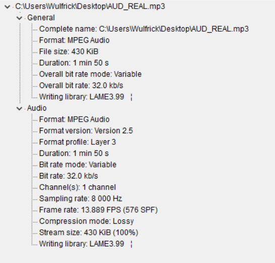

```{r setup, include=FALSE}
knitr::opts_chunk$set(echo = TRUE)
rm(list = ls())
ls()
getwd()
setwd("C:/Users/Wulfrick/Desktop/#AudicaoCognitiva")
```

# Análise de texto e áudio em um ambiente real
### Áudio REAL

Neste trabalho vamos analisar e comparar os audios e suas transcrições, visando a maior proximidade possível com um ambiente real de utilização das técnicas de audição cognitiva.

## - Propriedade do Áudio

Vamos começar a nossa análise pelas propriedades do audio que estamos utilizando em questão.

{#id .class width=50% height=70%}

Utiizando o programa **MediaInfo** conseguimos obter diversas informações sobre o áudio que vamos utilizar para análise, entre elas temos como mais importantes:

* Formato : **MPEG**
* Taxa de Bits: **32 kb/s**
* Número de canais: **Mono (1 canal)**
* Taxa de Amostragem: **8 kHz**

Após isso utilizamos a ferramenta demo do Watson para ouvir e transcrever este áudio.

## - Cálculo de Erro

Com a transcrição em mãos, vamos calcular a taxa de erro dada pelo retorno da trasncrição provida pelo próprio Watson, assim chegamos nos valores de:

* S (Substituição): **57**
* D (Exclusão): **7**
* I (Inserção): **5**
* W (Total de Palavras): **169**

Totalizando um **WER** de **0.327**, ou seja, *32%* de erro.

## - Análise do Texto Transcrito

```{r include=FALSE}
library(tm)
library(NLP)
library(qdap) # Quantitative discourse analysis of transcripts.
library(qdapDictionaries)
library(dplyr) # Data wrangling, pipe operator %>%().
library(RColorBrewer) # Generate palette of colours for plots.
library(ggplot2) # Plot word frequencies.
library(scales) # Include commas in numbers.

cps <- Corpus(DirSource('C:/Users/Wulfrick/Desktop/#AudicaoCognitiva/TranscritoReal',
                        encoding = "UTF-8"),
              readerControl = list(language = "pt"))

```

Depois de calcular o *WER* e pontuarmos a sua taxa de erro, vamos analisar agora o texto trasncrito utilizando algumas técnicas de NLP e outros métodos.

Ao Carregar o arquivo, nosso primeiro passo será tratar a formatação do texto, retirando espaços em branco, pontuação e reduzindo tudo a caixa baixa.

```{r echo=TRUE}
cps <- tm_map(cps, stripWhitespace)
cps <- tm_map(cps, content_transformer(tolower))
cps <- tm_map(cps, removeNumbers)
```

Depois de fazer este primeiro tratamento podemos ver o estado em que o nosso texto e suas principais palavras se encontram, para isso utilizamos uma plotagem no estilo "Wordcloud".

```{r echo=TRUE, warning=FALSE}
tdm <- TermDocumentMatrix(cps,
                          control = list(wordLengths = c(1, Inf)))

m <- as.matrix(tdm)
word.freq <- sort(rowSums(m), decreasing = T)
pal <- brewer.pal(9, "BuGn")
pal <- pal[-(1:4)]

library(wordcloud)
wordcloud(words = names(word.freq), freq = word.freq, min.freq = 2,
          random.order = F, colors = pal)
```

Podemos ver no gráfico que o nosso texto fica bastante sujeito a palavras que á principio não fazem sentido na nossa análise, como por exemplo a palavras 'de, que' e os artigos 'e, a'.

passamos então para a análise e retirada de Stopwords, começando com a biblioteca padrão de stopwords de palavras em português.

```{r echo=TRUE}
cps <- tm_map(cps, removeWords, stopwords("portuguese"))
```

Utilizamos do processo de TDM para a criação de uma matrix termos para que seja possível separar quais são os termos mais frequentes.

```{r echo=TRUE}
tdm <- TermDocumentMatrix(cps,
                          control = list(wordLengths = c(1, Inf)))
```

Com as palavras separadas, olhamos as palavras mais frequentes da nossa lista.

Neste caso estamos visulizando as palavras com uma frequencia maior do que 2 (Por se tratar de apenas uma transcrição e um texto pequeno).

```{r echo=TRUE}
(freq.terms <- findFreqTerms(tdm, lowfreq = 2))
```

Aqui reparamos que algumas palavras ainda não são tão importantes exclusivamente para a análise que queremos fazer e podemos retirá-las assim como fizemos com os Stopwords.

```{r echo=TRUE}
cps <- tm_map(cps, removeWords, c("wer", '-', '"', 'wav', 'flac', 'mp3', 'tão', 'é', 'né', "dois", "t", "o", "ta", "to", "tá"))

tdm <- TermDocumentMatrix(cps,
                          control = list(wordLengths = c(1, Inf)))
```

Podemos repetir este processo, como já fizemos, várias vezes, a fim de ir moldando a nossa base para que seja possível retirar as respostas que queremos dela.

Agora que temos a base tratada da forma que queremos, vamos começar a nossa análise de texto para descobrir sobre o conteúdo relevante que todos esses textos contém.

Novamente vamos utilizar o plot "Wordcloud" para visualizar a disposição das palavras dentro da nossa base e, possívelmente, retirar novos 'insights' que podem ajudar na nossa análise.

```{r echo=TRUE, warning=FALSE}
m <- as.matrix(tdm)
word.freq <- sort(rowSums(m), decreasing = T)
pal <- brewer.pal(9, "BuGn")
pal <- pal[-(1:4)]

library(wordcloud)
wordcloud(words = names(word.freq), freq = word.freq, min.freq = 2,
          random.order = F, colors = pal)
```

Neste momento continuar a repetir o processo de retirada e plotagem da base levando em configuração as informações que conseguimos através dos processos anteriores.

## - Conclusão

Com todos estes dados podemos enfim concluir a nossa análise.

Analizando o texto trasncrito podemos concluir que a idéia base é:

### "Atendimento sobre pagamento de conta"

Comparando a análise da transcrição com o texto original podemos ver que **a idéia ainda continua a mesma**.

Nesta análise vemos algo interessante, apesar de uma qualidade "inferior" de áudio em comparação ao Áudio UM e uma taxa de erro alta de *32%* o conteúdo base do texto ainda se mantém fiél ao texto original quando aplicamos as técnicas de audição cognitiva que aprendemos em aula.
